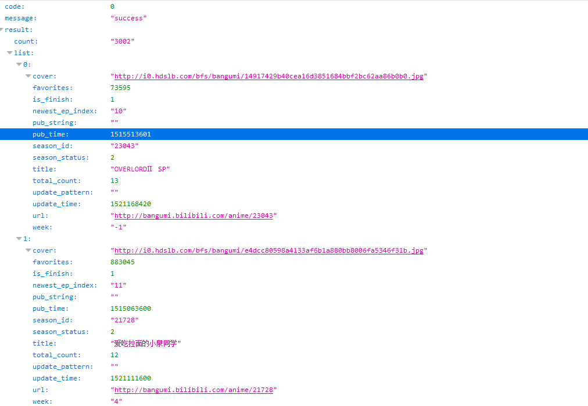
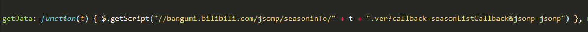
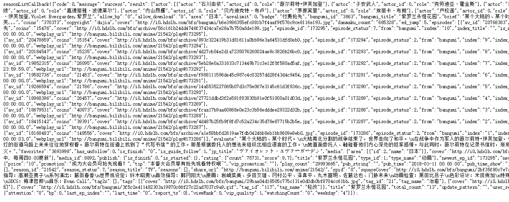

## 自写网页爬虫

包括：

+ bilibili新番播放数据爬虫
+ 。。。（待加）


## B站番剧播放数据

爬取B站所有正版番剧的视屏信息，目前目标需要获取如下基本数据：

+ 总的播放量、追番数、弹幕量、总集数
+ 单集的播放量、追番数、硬币数、分数
+ 放送年月和时间
+ 番剧Tag
+ 制作地区
+ 声优

以下为设计方案的主要流程。

#### 1. 番剧查找

通过如下API接口，查找不同年份、季度的新番列表：

```
https://bangumi.bilibili.com/web_api/season/index_global
```

通过制定如下参数来设置引索：

```
data  = {
    'page':0,           # 第几页
    'page_size':20,     # 每页的数量
    'version':0,        # 类型： 全部 正片 剧场版 其他 [0 - 4]
    'is_finish':0,      # 状态： 全部 完结 连载 [0 2 1]
    'start_year':2018,  # 时间： 全部 某一年 [0 xxxx]
    'tag_id':'',        # 风格
    'index_type':1,     # 排序方式: 更新时间 追番人数 开播时间 [0 - 2]
    'index_sort':0,     # 排序类型: 递减 递增 [0 - 1]
    'area':0,           # 地区: 全部 日本 美国 其他 [0 2 3 4]
    'quarter':0         # 季度： 全部 1月 4月 7月 10月 [0 - 4]
}
```

直接使用url可以得到json数据格式如下：



解析json数据可以得到番剧的一些基本信息，如番剧名、放松日期、和season_id、完结信息、总集数。

#### 2. 获取总集数据和单集的aid

为了得到更多信息和数据，我们需要利用番剧的season_id。分析网站的JS源码，我们能够找到网页前端使用了如下接口，来向服务器请求获取番剧的详细信息：



API格式为（中间season_id用实际值代替）：

```
http://bangumi.bilibili.com/jsonp/seasoninfo/season_id.ver?callback=seasonListCallback
```

得到数据如下：



解析得到详细的番剧信息，另外一个重要的就是单集番剧的aid。

#### 3. 获取单集番剧的信息

通过aid获取单个视屏的信息，这个接口在网上使用的比较广泛（xxxxxx换成实际的aid值即可）：

```
https://api.bilibili.com/x/web-interface/archive/stat?aid=xxxxxx
```

得到json数据如下：

```
{
    "code":0,
    "message":"0",
    "ttl":1,
    "data":
    {
        "aid":19801429,
        "view":985,
        "danmaku":8,
        "reply":8,
        "favorite":522,
        "coin":10,
        "share":9,
        "now_rank":0,
        "his_rank":0,
        "no_reprint":0,
        "copyright":2
    }
}
```
